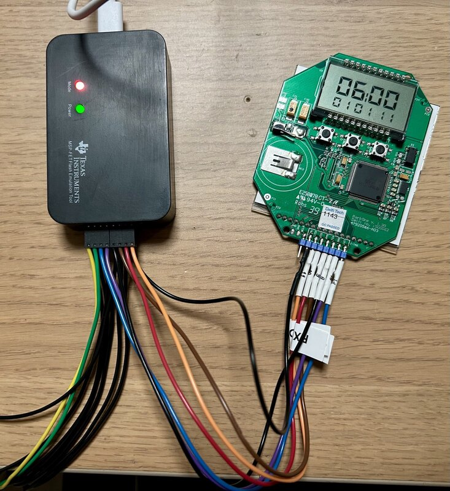
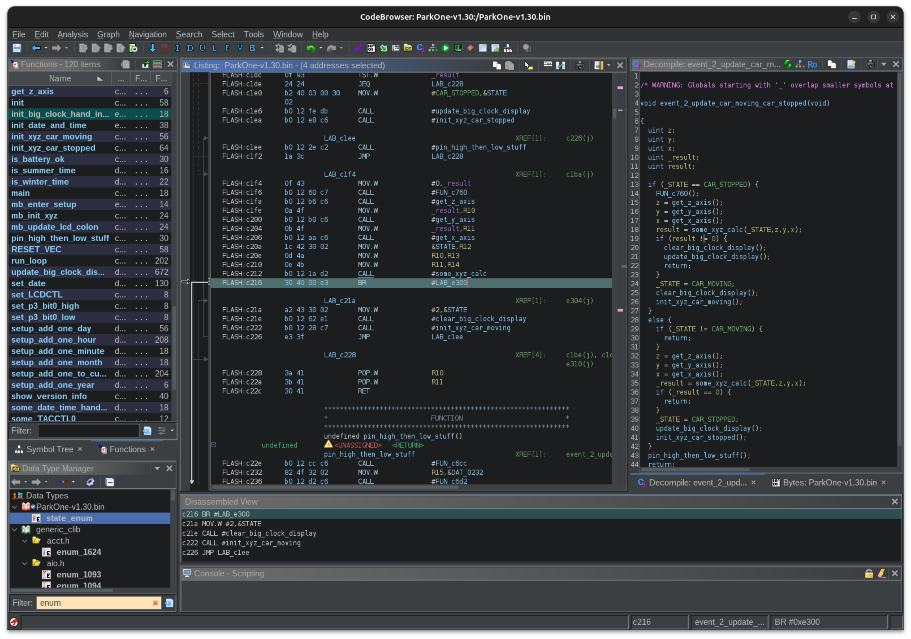
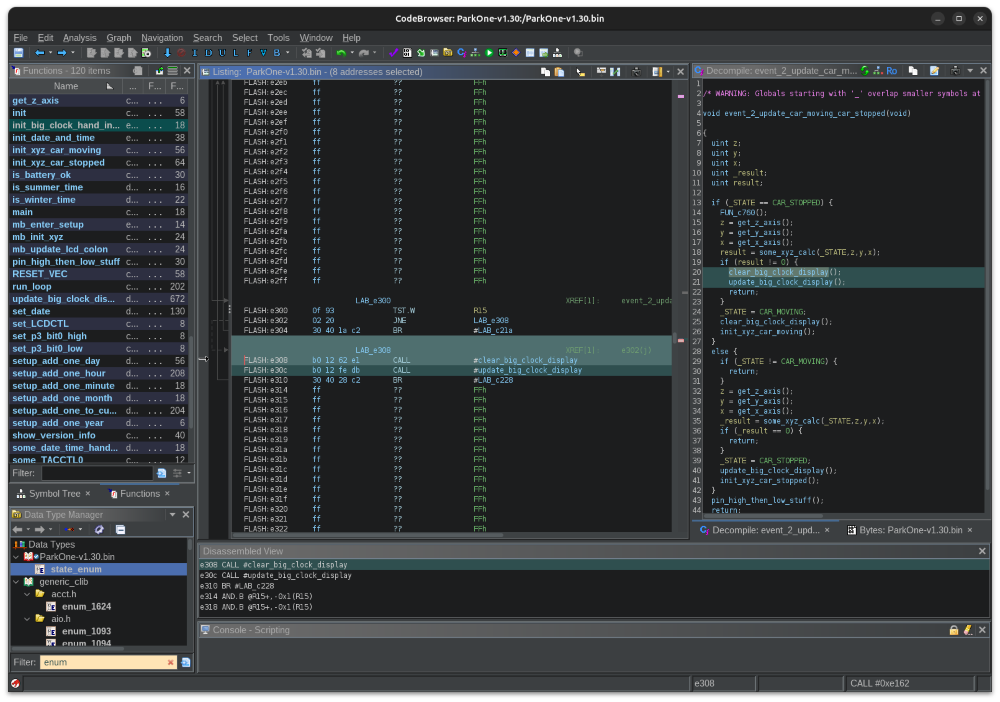
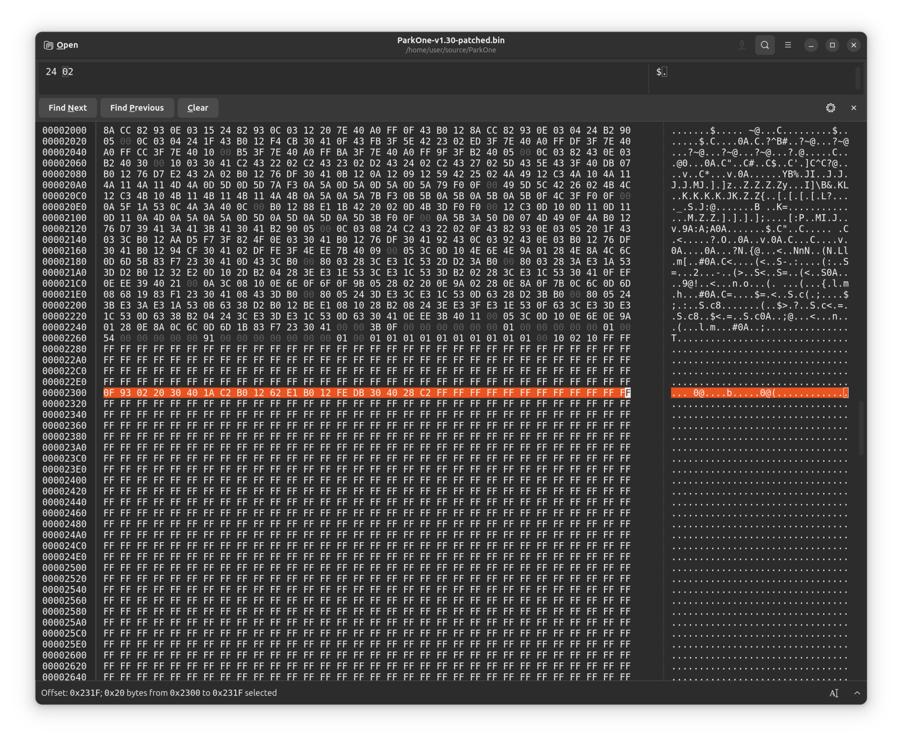
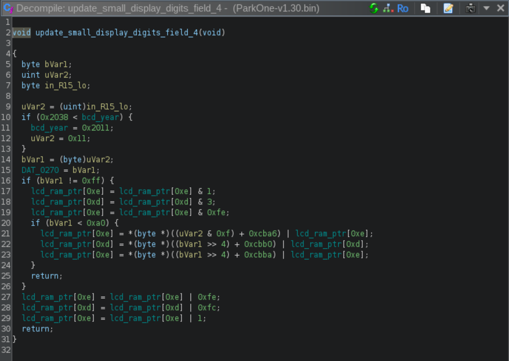

# ParkOne

## Automatic parking clock made better.

This parking clock will now update itself every 15 minutes.

A more or less fully reverse engineered firmware is available in this GitHub repository.

## Dumping setup

## Speed-up video capture to show the result.

<video src='https://github.com/user-attachments/assets/5d559d9d-a579-46d8-a4c9-042f381659ba'></video>

## Patched jump

## Shellcode in a code cave 

## Shellcode hex

## Fun fact: Much of the firmware is using BCD numbers (see year 0x2011-0x2038)

